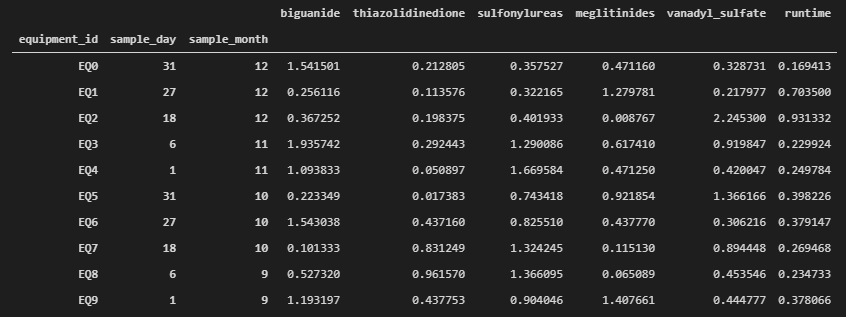
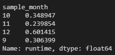

Welcome to the CMC Data Engineering Tech Exercise. We hope you'll enjoy completing it just as much as we've enjoyed doing it for you. Please bare in mind what's most important for us is understanding how you go about problem solving.

Giving just the precise answer or just the adequate code is sufficient, but you can also write an explanation of your solution or strategy, including diagrams, prints, or whatever you see fit. Your repo should be a clone of this one.

Optionally, you can simply send us your solutions by email. Either way, you'll get a chance to add/comment on your solution on the next interview.


Wishing you the best of lucks,
Grateful for your time so far,

**The NN CMC Data Foundation Team**


Should you have any questions, please contact Diogo at 31443612.

## exercise 1 DevOps
### exercise 1.1 SSH Clone

A team of chemists needs you to securely clone this repo with an SSH key. Show that you've successfuly cloned and pushed to your cloned public repo by sending us its url. 

*your explanation goes here, include prints wherever you find it appropriate*<br>
I opened my Git Bash in a local folder, executed the command "git clone SSH key", with the SSH copied from this repository. <br>
Afterwards I went into the cloned folder, changed the origin to mine public folder with the command "git remote set-url origin https://github.com/kpaulsen97/novodataeng.git". <br>
And finally pushed the files from my local repository to the public one with the command "git push -u origin main".


### exercise 1.2 Git Ops

The branching policy requires that you branch ``main`` to `dev`, and `dev` to feature branches `exercise21`, `exercise22` and `readme` (see image below).

```
main
│
╰─ dev
    │
    ├─ readme
    ├─ exercise21
    ╰─ exercise22
```

Develop the solution to exercise **2.1** in the ``exercise21`` branch. Commit , push and merge with `dev`. Branch to `exercise22`, develop the solution to exercise **2.2** and repeat the proccess. Don't forget not to delete the branches, we'll be looking at them.

When merging from `exercise22` to `dev`, force some sort of conflict. Explain how you fixed it in the commit message. 

All your edits to this file should me made on the `readme` branch.

After you have finished your exercises, merge to `dev` and then to `main`. We'll be checking the last push before 01:10, 16-05-2021.

*your explanation goes here, include prints wherever you find it appropriate*<br>
from the main branch, I've created and switched to dev with the command "git checkout -b dev".<br>
Afterwards I did the same for exercise21, so inside dev "git checkout -b exercise21".<br>
I've written my solution,committed it, pushed it to the origin with "git push --set-upstream origin exercise21", went to dev with the command "git checkout dev", and merged with exercise21 by doing "git merge exercise21". <br>
So I created exercise22 with "git checkout -b exercise22", I've written my solution, committed it, then I've overwritten completely some code inside exercise22 to cause a conflict, committed it, did the same in the branch dev, tried to merge and received the merge conflict error. 
Aborted the merge with "git merge --abort", reverted in dev to the past commit with "git revert --no-commit HEAD", committed it and gave it an appropriate explanatory message, did the same in exercise22, then pushed exercise22 to origin, and merged with dev, this time successfully.
Now I created another branch called readme and I'm currently modifying the README.md content. Once I'm done, I'll commit the changes, push to origin, merge with dev, and then I'll merge main with dev and push main to origin.


## exercise 1.3: Packages

Deploy a python package named `cmc_dataeng_internship_<your-name>` to PyPi. We'll be running `pip install cmc_dataeng_internship_<your-name>` and executing the python package such that:

```python
>>> from cmc_dataeng_internship_<your-name> import exercise13
>>> exercise13.moto()
Coding for our patients.
```

*your explanation goes here, include prints wherever you find it appropriate or code snippets*

- I created a folder named package. <br>
- Inside package, I created a folder named cmc_dataeng_internship_kenneth_paulsen. <br>
- Inside this other folder, I created a python script called exercise13 which contains the function which prints the required phrase. <br>
- In the package folder, I created a setup.py which calls the setup method and describes the package.
- in the cmd in the package folder I executed "python setup.py sdist", which creates meta data and essential source files needed for installing by pip. <br>
- finally I executed "twine upload dist/*" which uploads the package to PyPi. 

## exercise 2 Data Analytics
 You'll find a simple pandas exercise in `data_analytics.py`. The code you find is to be left untouched. You should replace only the lines where you read `# your solution here`. As a hint, your `equipment_measures` dataset could look something like this:

 
 
 to which the runtime averages would be:
 
 

 *your explanation goes here, include prints wherever you find it appropriate or code snippets*
 <br>
 2.1: <br>
 - created an array with the appropriate naming of the equipment. <br>
 - I've set it as the new index of a copy of equipments. <br>
 - set the index as a column, rename it, and dropped runtime (I thought it wasn't relevant in this exercise). <br>
 - created an multiindex with the just created df. <br>
 - set it as the index of measurements to create equipment_measurements. <br>

 2.2: <br>
 - selected the equipments that respected the condition required. <br>
 - selected the rows with the right equipments, and determined the average of runtime by month. 

